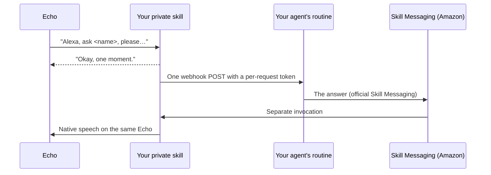

# Alexa agent bridge

Ask your AI agent questions through your Amazon Echo. You say “Alexa, ask Nova AI, please…”, Alexa replies “Okay, one moment.”, your agent does the work, and the answer is spoken on the Echo you asked from. “Nova AI” stands for whatever name your agent suggests.

You don't install anything. Give your agent this repository's link, at a release tag:

> Set up the Alexa bridge from https://github.com/eddielutte/alexa-agent-bridge, release &lt;tag&gt;.

Use the newest tag from this repository's **Releases** page. Releases are signed, and your agent checks the signature before running anything (key fingerprint `SHA256:jFE7AQS44EuMt6TVafQICt2UtpwoO9iQCFSQQ0q/j9k`; see [CONTRIBUTING](CONTRIBUTING.md#releases)).

Your agent follows [SETUP.md](SETUP.md) on its own computer. It builds a **private** Alexa skill in **your own** Amazon developer account and connects it to a routine on your agent. You sign in when asked, choose a name and country, and listen for a test sentence.

## Agents

The bridge works with any AI agent that has the [capabilities it needs](AGENT-REQUIREMENTS.md). In short:

- routines it can trigger with an authenticated webhook
- a computer it can run commands on
- a browser it can hand to you for sign-ins
- ideally, a secure store for secrets

| Agent | Status |
| --- | --- |
| Grokbot | **Tested** end to end in the United Kingdom. See its [profile](agents/grokbot.md) |
| Other agents | Untested. Check the [requirements](AGENT-REQUIREMENTS.md), follow the [profile guide](agents/README.md), and please [report how it went](CONTRIBUTING.md#agent-results) |

Agents that load skills in the open [Agent Skills](https://agentskills.io) format can also start from the [setup skill](skills/README.md); it still needs this link and a release tag. That route is untested.

## What you need

- An agent that meets the [requirements](AGENT-REQUIREMENTS.md). Its computer needs Python 3.9+, Node with npm, and git; setup installs Amazon's ASK CLI itself.
- An Amazon account with an Alexa developer profile. It's free: register at [developer.amazon.com](https://developer.amazon.com/).
- Your Echos registered to **that same Amazon account**. A private (Development-stage) skill only works on devices signed in to the developer account.
- About 30 minutes. The tested Grokbot setup took under 30 minutes, mostly waiting for Amazon.

## Before you start: important

- **Speech uses an unofficial Amazon interface.** Alexa skills have no official way to speak a late answer on a chosen Echo. This bridge signs in to your Amazon account, as the Alexa app does, to make your Echo speak. Amazon could change or block this at any time. You use it at your own risk, on your own account.
- **Everything stays in your accounts.** Your skill runs in Amazon's free Alexa-hosted service under your developer account. Your questions go only to your own agent's routine. This project runs no servers and collects nothing.
- **It isn't a product of Amazon or of any agent's maker,** and it isn't a published Alexa skill. Each owner runs their own private copy.

## Countries

The design works in every Alexa country. Status per country:

| Status | Countries |
| --- | --- |
| Proven (a real request answered) | United Kingdom |
| Untested (same services; not yet confirmed end to end) | Ireland, United States, Canada, Mexico, Brazil, India, Germany, France, Italy, Spain, Australia, New Zealand, Japan |

English works in every English-speaking country. For other languages your agent can draft a [language pack](LANGUAGE-PACKS.md) for you to check, but setting up in a language other than English is untested and not yet expected to finish. This also applies to the non-English Alexa languages in the United States (es-US), Canada (fr-CA) and India (hi-IN). Please [report your country's result](CONTRIBUTING.md#country-results) so this table improves.

## Everyday use

See the [cheat sheet](CHEAT-SHEET.md). At the end of setup your agent saves the [maintenance skill](skills/alexa-bridge-maintenance/SKILL.md) for re-sign-in, updates and removal.

## How it works

Uncertain deliveries are never repeated, answers can't choose a different Echo, and a newer request replaces an older pending answer.

## Repository

| Path | Contents |
| --- | --- |
| `SETUP.md`, `MAINTENANCE.md` | The setup guide your agent follows, and the maintenance steps |
| `AGENT-REQUIREMENTS.md`, `agents/` | What an agent needs, and one profile per agent with its platform-specific steps |
| `skills/` | Short [Agent Skills](https://agentskills.io) for setup and maintenance that point to the two guides above |
| `CHEAT-SHEET.md`, `LANGUAGE-PACKS.md` | Your everyday phrases, and how to add a language |
| `lambda/` | The Alexa-hosted skill (Python 3.8, stdlib only). `countries.json` holds country data, `lang_<code>.json` holds wording, and `bridge_config.json` is an example that setup replaces |
| `bridge/` | The setup tool your agent runs: `python3 -m bridge --help` |
| `routine-template.md` | The routine instructions, filled in by `bridge routine-text` |
| `models/`, `build_model.py` | Voice-model templates and the generator |
| `tests/` | Network-free tests: `python3 -m unittest discover -s tests` |

## Licence

Apache License 2.0; see [LICENSE](LICENSE). Copyright 2026 the alexa-agent-bridge authors.

The speech adapter and the Amazon sign-in follow the protocol used by the Apache-2.0 [aioamazondevices](https://github.com/chemelli74/aioamazondevices) library, with thanks to its authors.
